# Execution Plan

## Detailed Analysis Summary

### Project Type
- **Type**: Greenfield - New SaaS product
- **Complexity**: High - Full-stack serverless application with AI integration
- **Timeline**: Aggressive - Deploy to AWS by end of tomorrow

### Change Impact Assessment
- **User-facing changes**: Yes - Complete new Kanban board UI with AI-powered features
- **Structural changes**: Yes - Full serverless architecture from scratch
- **Data model changes**: Yes - New DynamoDB schema for multi-tenant Kanban data
- **API changes**: Yes - New REST and WebSocket APIs
- **NFR impact**: Yes - Performance, security, scalability, observability all critical

### Risk Assessment
- **Risk Level**: High
  - Complex multi-service architecture
  - AI integration with Bedrock
  - Real-time WebSocket requirements
  - Multi-tenancy security concerns
  - Aggressive timeline
- **Rollback Complexity**: N/A (greenfield)
- **Testing Complexity**: Complex - Multiple integration points, real-time features, AI validation

---

## Workflow Visualization

```mermaid
flowchart TD
    Start(["User Request"])
    
    subgraph INCEPTION["🔵 INCEPTION PHASE"]
        WD["Workspace Detection<br/><b>COMPLETED</b>"]
        RA["Requirements Analysis<br/><b>COMPLETED</b>"]
        US["User Stories<br/><b>SKIP</b>"]
        WP["Workflow Planning<br/><b>IN PROGRESS</b>"]
        AD["Application Design<br/><b>EXECUTE</b>"]
        UG["Units Generation<br/><b>EXECUTE</b>"]
    end
    
    subgraph CONSTRUCTION["🟢 CONSTRUCTION PHASE"]
        FD["Functional Design<br/><b>EXECUTE</b>"]
        NFRA["NFR Requirements<br/><b>EXECUTE</b>"]
        NFRD["NFR Design<br/><b>EXECUTE</b>"]
        ID["Infrastructure Design<br/><b>EXECUTE</b>"]
        CG["Code Generation<br/><b>EXECUTE</b>"]
        BT["Build and Test<br/><b>EXECUTE</b>"]
    end
    
    subgraph OPERATIONS["🟡 OPERATIONS PHASE"]
        OPS["Operations<br/><b>PLACEHOLDER</b>"]
    end
    
    Start --> WD
    WD --> RA
    RA --> US
    US -.-> WP
    RA --> WP
    WP --> AD
    AD --> UG
    UG --> FD
    FD --> NFRA
    NFRA --> NFRD
    NFRD --> ID
    ID --> CG
    CG -.->|Next Unit| FD
    CG --> BT
    BT -.-> OPS
    BT --> End(["Complete"])
    
    style WD fill:#4CAF50,stroke:#1B5E20,stroke-width:3px,color:#fff
    style RA fill:#4CAF50,stroke:#1B5E20,stroke-width:3px,color:#fff
    style US fill:#BDBDBD,stroke:#424242,stroke-width:2px,stroke-dasharray: 5 5,color:#000
    style WP fill:#FFA726,stroke:#E65100,stroke-width:3px,color:#000
    style AD fill:#FFA726,stroke:#E65100,stroke-width:3px,stroke-dasharray: 5 5,color:#000
    style UG fill:#FFA726,stroke:#E65100,stroke-width:3px,stroke-dasharray: 5 5,color:#000
    style FD fill:#FFA726,stroke:#E65100,stroke-width:3px,stroke-dasharray: 5 5,color:#000
    style NFRA fill:#FFA726,stroke:#E65100,stroke-width:3px,stroke-dasharray: 5 5,color:#000
    style NFRD fill:#FFA726,stroke:#E65100,stroke-width:3px,stroke-dasharray: 5 5,color:#000
    style ID fill:#FFA726,stroke:#E65100,stroke-width:3px,stroke-dasharray: 5 5,color:#000
    style CG fill:#4CAF50,stroke:#1B5E20,stroke-width:3px,color:#fff
    style BT fill:#4CAF50,stroke:#1B5E20,stroke-width:3px,color:#fff
    style OPS fill:#BDBDBD,stroke:#424242,stroke-width:2px,stroke-dasharray: 5 5,color:#000
    style Start fill:#CE93D8,stroke:#6A1B9A,stroke-width:3px,color:#000
    style End fill:#CE93D8,stroke:#6A1B9A,stroke-width:3px,color:#000
    style INCEPTION fill:#BBDEFB,stroke:#1565C0,stroke-width:3px,color:#000
    style CONSTRUCTION fill:#C8E6C9,stroke:#2E7D32,stroke-width:3px,color:#000
    style OPERATIONS fill:#FFF59D,stroke:#F57F17,stroke-width:3px,color:#000
    
    linkStyle default stroke:#333,stroke-width:2px
```

---

## Phases to Execute

### 🔵 INCEPTION PHASE

- [x] **Workspace Detection** - COMPLETED
  - Rationale: Confirmed greenfield project, no existing code

- [x] **Requirements Analysis** - COMPLETED
  - Rationale: Comprehensive requirements extracted from context document

- [ ] **User Stories** - SKIP
  - Rationale: Context document already contains excellent product thinking and clear feature definitions. Given aggressive timeline, skipping to maintain velocity while preserving quality through comprehensive design stages.

- [x] **Workflow Planning** - IN PROGRESS
  - Rationale: Determining optimal execution path for complex system

- [ ] **Application Design** - EXECUTE
  - Rationale: Complex system requiring clear component architecture, service boundaries, and business logic design. Need to define:
    - Frontend components (React board, cards, AI input)
    - Backend Lambda functions (REST handlers, WebSocket handlers, AI orchestration)
    - Service layer design (card management, AI services, bottleneck detection)
    - Component methods and responsibilities

- [ ] **Units Generation** - EXECUTE
  - Rationale: Large system requiring decomposition into manageable units for parallel development:
    - Frontend unit (React application)
    - Backend API unit (REST + WebSocket)
    - AI services unit (Bedrock integration, prompt management)
    - Infrastructure unit (CDK stacks)
    - Observability unit (CloudWatch, Kinesis)

### 🟢 CONSTRUCTION PHASE

**Per-Unit Execution** (following stages execute for each unit):

- [ ] **Functional Design** - EXECUTE (per unit)
  - Rationale: Each unit requires detailed functional design:
    - Data models (DynamoDB schemas for cards, tenants, connections)
    - Business logic (card operations, AI orchestration, bottleneck analysis)
    - API contracts (REST endpoints, WebSocket messages)
    - State management (frontend state, connection state)

- [ ] **NFR Requirements** - EXECUTE (per unit)
  - Rationale: Critical NFRs for each unit:
    - Performance (sub-second WebSocket latency, AI response times)
    - Security (multi-tenant isolation, authentication, authorization)
    - Scalability (serverless auto-scaling, DynamoDB capacity)
    - Observability (structured logging, metrics, cost tracking)

- [ ] **NFR Design** - EXECUTE (per unit)
  - Rationale: NFR patterns must be incorporated into design:
    - Caching strategies (API responses, AI prompts)
    - Error handling patterns (retry logic, circuit breakers)
    - Security patterns (tenant scoping, context assembly)
    - Monitoring patterns (structured logs, custom metrics)

- [ ] **Infrastructure Design** - EXECUTE (per unit)
  - Rationale: Map logical components to AWS services:
    - CDK stack structure (networking, compute, storage, AI)
    - Resource configurations (Lambda memory/timeout, DynamoDB capacity)
    - IAM roles and policies (least privilege)
    - Feature flags (AppConfig setup)

- [ ] **Code Generation** - EXECUTE (per unit, ALWAYS)
  - Rationale: Generate implementation code for each unit with Part 1 (Planning) and Part 2 (Generation)

- [ ] **Build and Test** - EXECUTE (ALWAYS, after all units)
  - Rationale: Comprehensive testing across all units:
    - Unit tests (Lambda functions, React components)
    - Integration tests (API + Lambda + DynamoDB, WebSocket flows)
    - AI validation tests (prompt quality, suggestion acceptance)
    - Multi-tenant isolation tests
    - Performance tests (WebSocket latency, AI response times)

### 🟡 OPERATIONS PHASE

- [ ] **Operations** - PLACEHOLDER
  - Rationale: Future deployment and monitoring workflows (build/test handled in Construction)

---

## Recommended Unit Breakdown

Based on the architecture, I recommend decomposing into these units:

### Unit 1: Infrastructure Foundation
- **Scope**: Core AWS infrastructure (VPC, DynamoDB tables, Parameter Store, AppConfig)
- **Priority**: Must complete first (foundation for all other units)
- **Deliverables**: CDK stack for base infrastructure

### Unit 2: Authentication & Multi-Tenancy
- **Scope**: Cognito setup, tenant management, authentication flows
- **Priority**: Must complete early (required for all user-facing features)
- **Deliverables**: Auth Lambda functions, tenant CRUD operations, CDK auth stack

### Unit 3: Backend API - Card Management
- **Scope**: REST API for card CRUD operations, DynamoDB access patterns
- **Priority**: Core functionality
- **Deliverables**: Lambda functions for card operations, API Gateway REST configuration

### Unit 4: Backend API - WebSocket
- **Scope**: WebSocket connection management, real-time broadcast, connection state
- **Priority**: Core functionality (multi-user sync)
- **Deliverables**: Lambda functions for WebSocket lifecycle, connection table, broadcast logic

### Unit 5: AI Services - Task Creation
- **Scope**: Bedrock integration, prompt management, AI card generation
- **Priority**: Core AI feature
- **Deliverables**: Lambda for AI orchestration, prompts in Parameter Store, async response handling

### Unit 6: AI Services - Bottleneck Detection
- **Scope**: Scheduled analysis (EventBridge), event-driven analysis (DynamoDB Streams)
- **Priority**: Core AI feature
- **Deliverables**: Lambda for both analysis modes, alert generation, WebSocket push

### Unit 7: Frontend Application
- **Scope**: React SPA with board UI, card components, AI input, real-time sync
- **Priority**: User interface
- **Deliverables**: React app, component library, WebSocket client, S3/CloudFront deployment

### Unit 8: Observability & Analytics
- **Scope**: CloudWatch dashboards, structured logging, Kinesis analytics, cost tracking
- **Priority**: Operational excellence
- **Deliverables**: CDK observability stack, log patterns, metrics, dashboards

---

## Execution Strategy

### Parallel Development Opportunities
- **Units 1-2**: Sequential (foundation first, then auth)
- **Units 3-6**: Can be developed in parallel after Unit 2 completes
- **Unit 7**: Can start after Unit 3 has API contracts defined
- **Unit 8**: Can be developed in parallel throughout

### Critical Path
1. Infrastructure Foundation (Unit 1)
2. Authentication & Multi-Tenancy (Unit 2)
3. Backend APIs + AI Services (Units 3-6 in parallel)
4. Frontend Application (Unit 7)
5. Observability (Unit 8)
6. Integration & Testing

### Timeline Estimate
Given aggressive timeline (end of tomorrow):
- **INCEPTION Phase**: 2-3 hours (Application Design + Units Generation)
- **CONSTRUCTION Phase**: 18-20 hours (design + code generation for 8 units)
- **Build and Test**: 2-3 hours (integration testing, deployment validation)
- **Total**: ~24 hours (tight but achievable with AI-DLC velocity)

---

## Success Criteria

### Primary Goal
Deploy functional AI-driven Kanban board SaaS to AWS with core features operational

### Key Deliverables
- ✅ Working Kanban board (create, move, edit cards)
- ✅ AI task creation (natural language to structured card)
- ✅ Proactive bottleneck detection (scheduled + event-driven)
- ✅ Multi-user real-time sync (WebSocket)
- ✅ Multi-tenancy foundations (data isolation, tenant scoping)
- ✅ Infrastructure as Code (CDK)
- ✅ Observability tooling (logs, metrics, dashboards)
- ✅ Deployed and operational in AWS

### Quality Gates
- All Lambda functions have unit tests
- Integration tests validate API + database interactions
- WebSocket real-time sync validated
- AI features tested with sample prompts
- Multi-tenant isolation verified
- Cost tracking operational
- Deployment successful with health checks passing

---

## Risk Mitigation

### Timeline Risk
- **Mitigation**: Focus on MVP features only, leverage AI-DLC for rapid generation, use proven AWS patterns

### AI Quality Risk
- **Mitigation**: Start with simple prompts, iterate based on results, human confirmation required

### Multi-Tenancy Security Risk
- **Mitigation**: Tenant scoping enforced at every Lambda operation, comprehensive testing

### Integration Complexity Risk
- **Mitigation**: Clear API contracts, integration tests for each service boundary, incremental integration

---

## Assumptions

1. AWS account ready with appropriate permissions
2. Bedrock access enabled (Claude model)
3. Development environment configured (Node.js, AWS CDK, AWS CLI)
4. Single AWS region deployment (us-east-1 or similar)
5. Basic authentication sufficient (Cognito email/password)
6. Single board per tenant for MVP
7. Desktop web browser primary target
