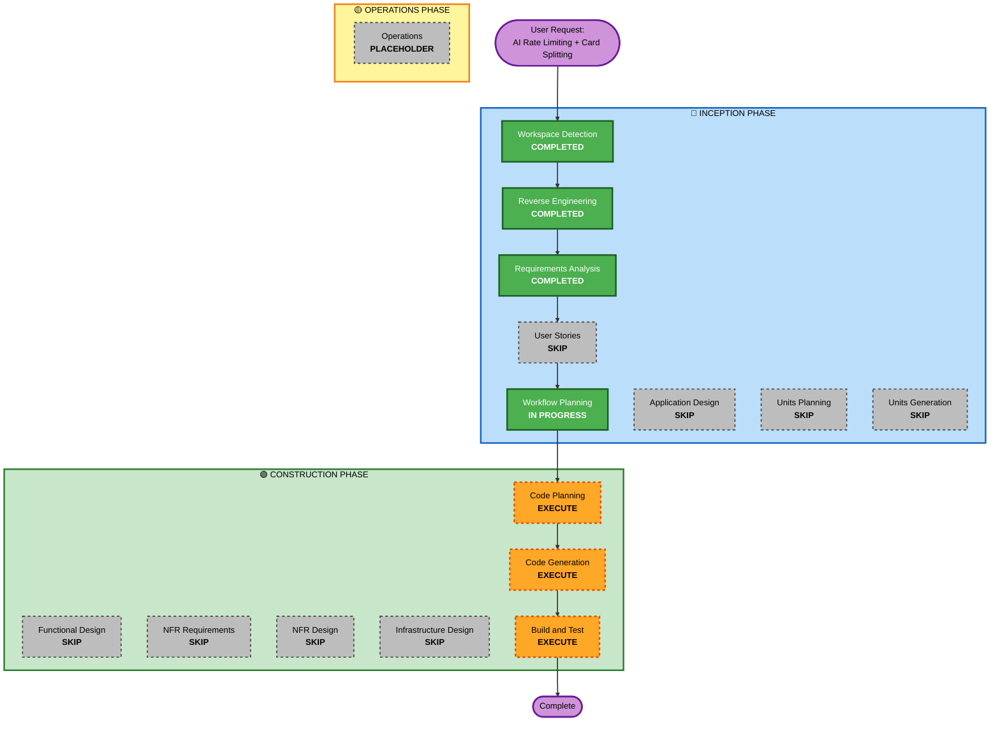

# Execution Plan - Iteration 2

## Detailed Analysis Summary

### Transformation Scope
- **Transformation Type**: Enhancement - Existing AI features
- **Primary Changes**: AI Task Handler, Bedrock Service, Frontend UI components
- **Related Components**: 
  - Backend: AI Task Handler, Bedrock Service
  - Frontend: AI modal, status indicators
  - Infrastructure: No changes (existing Lambda/API Gateway)

### Change Impact Assessment
- **User-facing changes**: Yes - New UI components for rate limiting status and card split preview
- **Structural changes**: No - Working within existing architecture
- **Data model changes**: Yes - Add `columnEnteredAt` field to Card model
- **API changes**: Yes - Enhanced error responses with retry-after information
- **NFR impact**: Yes - Improved reliability and user experience with retry logic

### Component Relationships
**Primary Components**:
- `backend/src/handlers/ai-task.ts` - Add retry logic, split detection
- `backend/src/services/bedrock.ts` - Add `suggestCardSplit` method, retry wrapper
- `frontend/src/App.tsx` - Add status indicator, split preview modal

**Supporting Components**:
- `backend/src/handlers/cards.ts` - Update `columnEnteredAt` on column change
- `backend/src/handlers/ai-bottleneck.ts` - Add duration-based alert logic
- `backend/src/types/index.ts` - Add new TypeScript interfaces

**Infrastructure Components**:
- No infrastructure changes required
- Existing Lambda functions, API Gateway, DynamoDB

### Risk Assessment
- **Risk Level**: Low-Medium
- **Rollback Complexity**: Easy - Revert Lambda code, no schema changes
- **Testing Complexity**: Moderate - Need to test retry logic, split workflow, duration tracking

---

## Workflow Visualization

---

## Phases to Execute

### 🔵 INCEPTION PHASE
- [x] Workspace Detection - COMPLETED
- [x] Reverse Engineering - COMPLETED
- [x] Requirements Analysis - COMPLETED
- [x] User Stories - SKIP
  - **Rationale**: Simple enhancement with clear requirements, no user personas needed
- [x] Workflow Planning - IN PROGRESS
- [ ] Application Design - SKIP
  - **Rationale**: No new components or services, working within existing architecture
- [ ] Units Planning - SKIP
  - **Rationale**: Single cohesive enhancement, no need to decompose into units
- [ ] Units Generation - SKIP
  - **Rationale**: Units Planning skipped

### 🟢 CONSTRUCTION PHASE
- [ ] Functional Design - SKIP
  - **Rationale**: No new data models or complex business logic, straightforward implementation
- [ ] NFR Requirements - SKIP
  - **Rationale**: NFR requirements already captured in requirements.md
- [ ] NFR Design - SKIP
  - **Rationale**: NFR Requirements skipped
- [ ] Infrastructure Design - SKIP
  - **Rationale**: No infrastructure changes, using existing Lambda/API Gateway/DynamoDB
- [ ] Code Planning - EXECUTE (ALWAYS)
  - **Rationale**: Need detailed implementation plan with file changes and checkboxes
- [ ] Code Generation - EXECUTE (ALWAYS)
  - **Rationale**: Implement AI rate limiting, card splitting, duration tracking
- [ ] Build and Test - EXECUTE (ALWAYS)
  - **Rationale**: Build, test, and verify all changes work correctly

### 🟡 OPERATIONS PHASE
- [ ] Operations - PLACEHOLDER
  - **Rationale**: Future deployment and monitoring workflows

---

## Implementation Approach

### Phase 1: Rate Limiting with Retry Logic (1-1.5 hours)

**Backend Changes**:
1. `backend/src/services/bedrock.ts`:
   - Add `invokeBedrockWithRetry` wrapper function
   - Implement exponential backoff (1s, 2s, 4s, 8s)
   - Extract retry-after from Bedrock errors
   - Max 3 retries before returning error

2. `backend/src/handlers/ai-task.ts`:
   - Use `invokeBedrockWithRetry` instead of direct invocation
   - Return structured error with `retryAfter` field
   - HTTP 429 status for rate limit errors

**Frontend Changes**:
3. `frontend/src/App.tsx`:
   - Add `aiRequestStatus` state (Ready, Processing, Retrying, Rate Limited)
   - Add countdown timer state
   - Display status indicator near "Create with AI" button
   - Show countdown when rate limited
   - Disable button during countdown

**Testing**:
- Make rapid AI requests to trigger throttling
- Verify exponential backoff retries
- Verify countdown timer appears after retries exhausted
- Verify button re-enables after countdown

---

### Phase 2: Card Splitting Detection (1.5-2 hours)

**Backend Changes**:
1. `backend/src/services/bedrock.ts`:
   - Add `suggestCardSplit(card)` method
   - Invoke Haiku with split prompt
   - Parse response into 2-4 smaller cards
   - Return `CardSplitSuggestion` object

2. `backend/src/handlers/ai-task.ts`:
   - After AI generates card, check if `storyPoints > 8`
   - If yes, call `suggestCardSplit`
   - Return split suggestion to frontend (don't create cards yet)
   - Frontend will decide whether to create split or original

3. `backend/src/types/index.ts`:
   - Add `CardSplitSuggestion` interface
   - Add `AICardSuggestion` interface (if not exists)

**Frontend Changes**:
4. `frontend/src/App.tsx`:
   - Add `showSplitPreview` state
   - Add `splitSuggestion` state
   - When AI response includes split suggestion, show preview modal
   - Display original card vs. split cards
   - Show story points comparison
   - Provide "Create Split Cards" and "Create Original Anyway" buttons
   - On approve: POST each split card to `/cards`
   - On reject: POST original card to `/cards`

**Testing**:
- Create task with >8 story points
- Verify split suggestion appears
- Test approve workflow (creates split cards)
- Test reject workflow (creates original card)
- Verify all cards broadcast to WebSocket clients

---

### Phase 3: Duration Tracking (0.5-1 hour)

**Backend Changes**:
1. `backend/src/types/index.ts`:
   - Add `columnEnteredAt?: string` to Card interface

2. `backend/src/handlers/cards.ts`:
   - In PUT handler, detect if column changed
   - If column changed, set `columnEnteredAt` to current timestamp
   - If column unchanged, don't modify `columnEnteredAt`

3. `backend/src/handlers/ai-bottleneck.ts`:
   - For each card, calculate duration in current column
   - If `columnEnteredAt` exists: `duration = Date.now() - columnEnteredAt`
   - Generate alerts for cards with duration > 7 days (medium) or > 14 days (high)
   - Include duration-based alerts in existing bottleneck analysis

**Testing**:
- Create card, move between columns
- Verify `columnEnteredAt` updates on column change
- Wait (or manually set old timestamp) and trigger bottleneck analysis
- Verify duration-based alerts appear

---

## Package Change Sequence

**Single-pass implementation** (no dependencies between changes):
1. Backend: Bedrock service (retry logic + split method)
2. Backend: AI Task Handler (use retry logic, split detection)
3. Backend: Cards Handler (duration tracking)
4. Backend: Bottleneck Handler (duration alerts)
5. Backend: Types (new interfaces)
6. Frontend: App component (status indicator, split preview, countdown)

**No coordination required** - all changes are independent and can be deployed together.

---

## Estimated Timeline

- **Phase 1 (Rate Limiting)**: 1-1.5 hours
- **Phase 2 (Card Splitting)**: 1.5-2 hours
- **Phase 3 (Duration Tracking)**: 0.5-1 hour
- **Total**: 3-4.5 hours

**Breakdown**:
- Code Planning: 15-30 minutes
- Code Generation: 2.5-3.5 hours
- Build and Test: 30-45 minutes

---

## Success Criteria

Iteration 2 is complete when:

1. ✅ Backend automatically retries throttled requests with exponential backoff (3 retries max)
2. ✅ Users see status indicator showing request state (Ready, Processing, Retrying, Rate Limited)
3. ✅ Users see countdown timer only when all retries are exhausted
4. ✅ AI automatically detects cards with >8 story points
5. ✅ Users can preview and approve/reject card splits
6. ✅ Split cards are created as independent cards in "To Do" column
7. ✅ Bottleneck analysis includes duration-based alerts for aging cards
8. ✅ Cards track when they entered their current column
9. ✅ All features work without breaking existing functionality
10. ✅ Implementation completed within 3-4 hours

---

## Quality Gates

**Before Code Generation**:
- [ ] Code plan reviewed and approved
- [ ] All file changes identified
- [ ] Implementation approach clear

**Before Build and Test**:
- [ ] All code changes implemented
- [ ] TypeScript compiles without errors
- [ ] No obvious bugs or issues

**Before Completion**:
- [ ] Manual testing completed
- [ ] All success criteria met
- [ ] No regressions in existing functionality

---

## Rollback Plan

**If issues arise**:
1. Revert Lambda function code to previous version (via AWS Console or CDK)
2. No database migration needed (DynamoDB is schemaless)
3. Existing cards continue to work without `columnEnteredAt` field
4. Frontend changes are backward compatible (gracefully handle missing fields)

**Rollback complexity**: Easy - Single Lambda deployment revert

---

## Next Steps

1. **Approve this execution plan**
2. **Proceed to Code Planning** - Create detailed implementation plan with checkboxes
3. **Code Generation** - Implement all changes
4. **Build and Test** - Verify everything works
5. **Complete iteration 2** - Deploy and celebrate! 🎉
