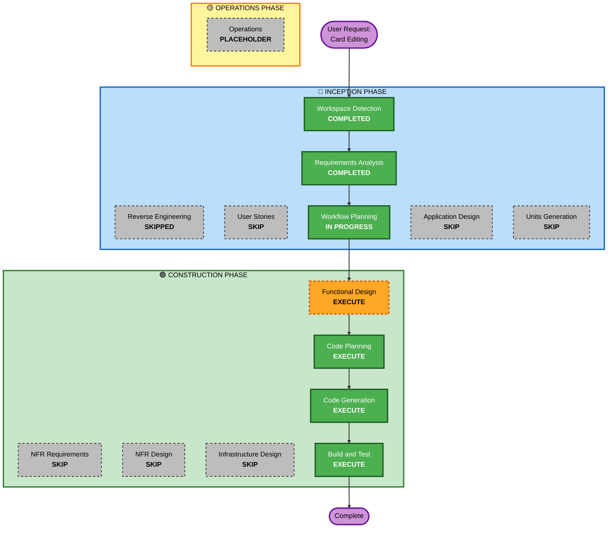

# Execution Plan - Iteration 4: Card Editing Feature

## Detailed Analysis Summary

### Transformation Scope
- **Transformation Type**: Single component enhancement
- **Primary Changes**: Add card editing capability to existing Kanban board
- **Related Components**: 
  - Frontend: React App component (App.tsx)
  - Backend: Cards Lambda handler (handlers/cards.ts)
  - Existing: WebSocket service, DynamoDB service

### Change Impact Assessment
- **User-facing changes**: Yes - New modal dialog for editing cards, double-click interaction
- **Structural changes**: No - No architectural changes, uses existing components
- **Data model changes**: No - No DynamoDB schema changes, uses existing card structure
- **API changes**: No - Uses existing PUT /cards/{id} endpoint
- **NFR impact**: Minimal - Performance requirements already met by existing infrastructure

### Component Relationships
```
Primary Component: Frontend (flowstate/src/App.tsx)
    |
    +-- Uses: Backend Cards Handler (backend/handlers/cards.ts)
    |       |
    |       +-- Uses: DynamoDB Service (backend/services/dynamodb.ts)
    |       +-- Uses: WebSocket Service (backend/services/websocket.ts)
    |
    +-- Integrates: Existing modal patterns (card creation modal)
    +-- Integrates: Existing validation logic
    +-- Integrates: Existing WebSocket connection
```

**Component Change Types**:
- **Frontend (App.tsx)**: Major - New edit modal component, double-click handler, form validation
- **Backend (cards.ts)**: Minor - PUT endpoint already exists, may need validation refinement
- **Infrastructure**: None - No CDK changes required
- **Database**: None - No schema changes required

### Risk Assessment
- **Risk Level**: Low
- **Rollback Complexity**: Easy - Frontend-only changes can be reverted quickly
- **Testing Complexity**: Moderate - Need to test concurrent edits, validation, real-time broadcasting
- **Rationale**: 
  - Uses existing API endpoints and infrastructure
  - No breaking changes to existing functionality
  - Isolated to card editing feature
  - Easy to test and validate

## Workflow Visualization



## Phases to Execute

### 🔵 INCEPTION PHASE
- [x] Workspace Detection (COMPLETED)
- [x] Reverse Engineering (SKIPPED - using existing iteration 2/3 artifacts)
- [x] Requirements Analysis (COMPLETED)
- [x] User Stories (SKIP)
  - **Rationale**: Requirements are clear and comprehensive. User scenarios already documented in requirements.md. Timeline efficiency prioritized for this focused enhancement.
- [x] Workflow Planning (IN PROGRESS)
- [ ] Application Design (SKIP)
  - **Rationale**: No new components needed. Edit modal follows existing card creation modal pattern. Component boundaries unchanged.
- [ ] Units Generation (SKIP)
  - **Rationale**: Single cohesive feature, no decomposition needed. All changes in one unit of work.

### 🟢 CONSTRUCTION PHASE
- [ ] Functional Design (EXECUTE)
  - **Rationale**: Need to design edit modal UI structure, form validation logic, and state management for edit operations.
- [ ] NFR Requirements (SKIP)
  - **Rationale**: Performance, security, and scalability requirements already met by existing infrastructure. No new NFR concerns.
- [ ] NFR Design (SKIP)
  - **Rationale**: No NFR requirements to implement.
- [ ] Infrastructure Design (SKIP)
  - **Rationale**: No infrastructure changes required. Uses existing Lambda, API Gateway, DynamoDB, and WebSocket infrastructure.
- [ ] Code Planning (EXECUTE - ALWAYS)
  - **Rationale**: Need detailed implementation plan for frontend modal and backend validation refinements.
- [ ] Code Generation (EXECUTE - ALWAYS)
  - **Rationale**: Implement edit modal, validation, and integration with existing API.
- [ ] Build and Test (EXECUTE - ALWAYS)
  - **Rationale**: Build, test, and verify card editing functionality including concurrent edit scenarios.

### 🟡 OPERATIONS PHASE
- [ ] Operations (PLACEHOLDER)
  - **Rationale**: Future deployment and monitoring workflows

## Package Change Sequence
Single-unit implementation (no multi-package coordination needed):

1. **Frontend (flowstate)**: Add edit modal component, double-click handler, validation
2. **Backend (backend)**: Refine PUT endpoint validation if needed
3. **Integration**: Test real-time broadcasting and concurrent edits

## Estimated Timeline
- **Total Phases to Execute**: 4 (Functional Design, Code Planning, Code Generation, Build and Test)
- **Estimated Duration**: 2-3 hours
  - Functional Design: 30 minutes
  - Code Planning: 30 minutes
  - Code Generation: 60-90 minutes
  - Build and Test: 30 minutes

## Success Criteria

### Primary Goal
Enable users to edit all card fields via double-click modal interface with real-time broadcasting

### Key Deliverables
- Edit modal component with all card fields
- Double-click interaction handler
- Form validation (client and server-side)
- Save/cancel behavior with proper state management
- Real-time WebSocket broadcasting of edits
- Integration with existing card creation patterns

### Quality Gates
- All acceptance criteria in requirements.md met
- Validation prevents invalid data entry
- Real-time updates work across multiple clients
- No breaking changes to existing functionality
- Concurrent edit scenarios tested (last save wins)
- Code follows existing patterns and conventions

### Integration Testing
- Edit modal opens on double-click
- All fields editable and validated
- Save persists changes and broadcasts to other users
- Cancel/click-outside discards changes
- Concurrent edits handled correctly (last save wins)
- AI-generated cards editable without restrictions

### Operational Readiness
- No infrastructure changes required
- Existing monitoring and logging sufficient
- Deployment via existing CI/CD pipeline
- Rollback plan: Revert frontend changes if issues arise
