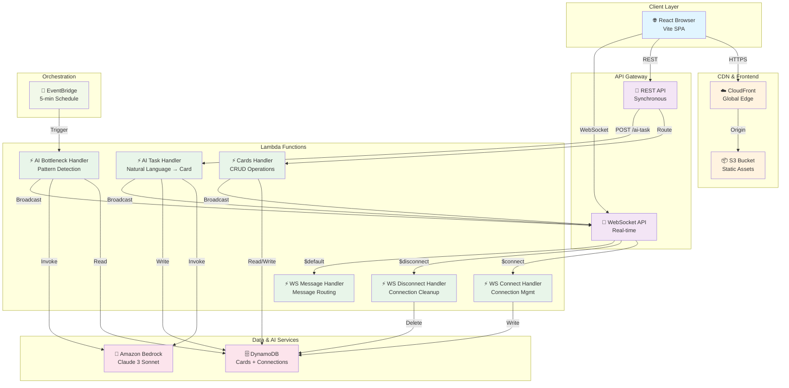

# System Architecture

## System Overview

FlowState is a fully serverless, AWS-native Kanban board application with AI-powered task generation and bottleneck detection. The architecture separates concerns into three layers:

1. **Frontend Layer**: React SPA served via S3 + CloudFront
2. **API Layer**: REST and WebSocket APIs via API Gateway
3. **Compute Layer**: 5 Lambda functions handling business logic
4. **Data Layer**: DynamoDB for persistence, Bedrock for AI
5. **Orchestration Layer**: EventBridge for scheduled tasks

All infrastructure is provisioned via AWS CDK with three stacks: Storage, API, and Frontend.

## Architecture Diagram



## Component Descriptions

### Frontend Components

#### React Application (App.tsx)
- **Purpose**: Main Kanban board UI
- **Responsibilities**:
  - Render 3-column Kanban board (To Do, In Progress, Done)
  - Manage card state and UI interactions
  - Handle drag-and-drop card movement
  - Provide modal dialogs for card creation and AI task generation
  - Maintain WebSocket connection for real-time updates
  - Display and manage bottleneck alerts in side panel
  - Persist user preferences to localStorage

### API Gateway

#### REST API
- **Base URL**: `https://xtv386hpgi.execute-api.ap-southeast-2.amazonaws.com/prod/`
- **Routes**:
  - `GET /cards` → Cards Handler (list all cards)
  - `GET /cards/{id}` → Cards Handler (get single card)
  - `POST /cards` → Cards Handler (create card)
  - `PUT /cards/{id}` → Cards Handler (update card)
  - `DELETE /cards/{id}` → Cards Handler (delete card)
  - `POST /ai-task` → AI Task Handler (generate card from description)
- **CORS**: Enabled for all origins

#### WebSocket API
- **Base URL**: `wss://a2ha2ia4wd.execute-api.ap-southeast-2.amazonaws.com/prod`
- **Routes**:
  - `$connect` → WS Connect Handler
  - `$disconnect` → WS Disconnect Handler
  - `$default` → WS Message Handler
- **Events Broadcast**:
  - `card_created`: New card created
  - `card_updated`: Card moved or metadata changed
  - `card_deleted`: Card removed
  - `bottleneck_alerts`: Workflow impediments detected

### Lambda Functions

#### Cards Handler
- **Runtime**: Node.js 20
- **Timeout**: 30 seconds
- **Memory**: 128 MB (default)
- **Permissions**: Read/Write DynamoDB (Cards + Connections), WebSocket Management
- **Triggers**: REST API Gateway
- **Responsibilities**:
  - Route HTTP requests to appropriate CRUD operation
  - Validate request payloads
  - Perform DynamoDB operations
  - Broadcast changes to WebSocket clients
  - Handle CORS preflight requests

#### AI Task Handler
- **Runtime**: Node.js 20
- **Timeout**: 60 seconds
- **Memory**: 512 MB
- **Permissions**: Read/Write DynamoDB (Cards), Read DynamoDB (Connections), Bedrock InvokeModel, WebSocket Management
- **Triggers**: REST API Gateway (POST /ai-task)
- **Responsibilities**:
  - Parse natural language task description
  - Retrieve board context (card count, columns)
  - Invoke Claude 3 Sonnet via Bedrock
  - Parse AI response and extract structured card data
  - Create card in DynamoDB
  - Broadcast new card to WebSocket clients

#### AI Bottleneck Handler
- **Runtime**: Node.js 20
- **Timeout**: 60 seconds
- **Memory**: 512 MB
- **Permissions**: Read DynamoDB (Cards + Connections), Bedrock InvokeModel, WebSocket Management
- **Triggers**: EventBridge (every 5 minutes)
- **Responsibilities**:
  - Retrieve all cards from DynamoDB
  - Invoke Claude 3 Sonnet to analyze for bottlenecks
  - Parse AI response and extract alerts
  - Broadcast alerts to WebSocket clients

#### WebSocket Connect Handler
- **Runtime**: Node.js 20
- **Timeout**: 30 seconds
- **Memory**: 128 MB
- **Permissions**: Write DynamoDB (Connections)
- **Triggers**: WebSocket API ($connect route)
- **Responsibilities**:
  - Extract connection ID from request context
  - Add connection to Connections table with TTL (24 hours)
  - Return 200 OK

#### WebSocket Disconnect Handler
- **Runtime**: Node.js 20
- **Timeout**: 30 seconds
- **Memory**: 128 MB
- **Permissions**: Write DynamoDB (Connections)
- **Triggers**: WebSocket API ($disconnect route)
- **Responsibilities**:
  - Extract connection ID from request context
  - Remove connection from Connections table
  - Return 200 OK

#### WebSocket Message Handler
- **Runtime**: Node.js 20
- **Timeout**: 30 seconds
- **Memory**: 128 MB
- **Permissions**: None (placeholder)
- **Triggers**: WebSocket API ($default route)
- **Responsibilities**:
  - Acknowledge incoming messages
  - Route to appropriate handler if needed

### Data Layer

#### DynamoDB - Cards Table
- **Partition Key**: `id` (String)
- **Billing Mode**: On-demand (auto-scaling)
- **Stream**: NEW_AND_OLD_IMAGES
- **Global Secondary Index**: `ColumnIndex`
  - **Partition Key**: `column` (String)
  - **Sort Key**: `position` (Number)
- **Attributes**:
  - `id`: Unique card identifier (UUID)
  - `title`: Card title (max 60 chars)
  - `description`: Detailed description
  - `column`: Current column (To Do, In Progress, Done)
  - `position`: Order within column
  - `storyPoints`: Fibonacci estimate (1, 2, 3, 5, 8, 13)
  - `priority`: low, medium, high
  - `acceptanceCriteria`: Array of criteria strings
  - `aiGenerated`: Boolean flag for AI-created cards
  - `createdAt`: ISO timestamp
  - `updatedAt`: ISO timestamp

#### DynamoDB - Connections Table
- **Partition Key**: `connectionId` (String)
- **Billing Mode**: On-demand
- **TTL Attribute**: `ttl` (24 hours)
- **Attributes**:
  - `connectionId`: WebSocket connection ID
  - `connectedAt`: ISO timestamp
  - `ttl`: Unix timestamp for automatic cleanup

### AI Services

#### Amazon Bedrock - Claude 3 Sonnet
- **Model ID**: `anthropic.claude-3-sonnet-20240229-v1:0`
- **Max Tokens**: 1000 (task generation), 2000 (bottleneck analysis)
- **Temperature**: 0.3 (low for consistency)
- **Input Format**: JSON with anthropic_version, max_tokens, temperature, messages
- **Output Format**: Structured JSON (task suggestions or alerts)

### Orchestration

#### EventBridge Rule
- **Name**: BottleneckDetectionRule
- **Schedule**: Every 5 minutes (rate(5 minutes))
- **Target**: AI Bottleneck Handler Lambda
- **Purpose**: Trigger periodic board analysis for workflow impediments

### Infrastructure Stacks

#### Storage Stack
- **Stack Name**: KanbanStorageStack
- **Resources**:
  - Cards DynamoDB table
  - Connections DynamoDB table
- **Outputs**:
  - CardsTableName
  - ConnectionsTableName

#### API Stack
- **Stack Name**: KanbanApiStack
- **Resources**:
  - Lambda layer (shared dependencies)
  - 6 Lambda functions (cards, ai-task, ai-bottleneck, ws-connect, ws-disconnect, ws-message)
  - REST API Gateway
  - WebSocket API Gateway
  - EventBridge rule
  - IAM roles and policies
- **Outputs**:
  - RestApiUrl
  - WebSocketUrl

#### Frontend Stack
- **Stack Name**: FlowStateFrontendStack
- **Resources**:
  - S3 bucket (private, no public access)
  - CloudFront distribution
  - Origin access control
  - S3 bucket deployment
- **Outputs**:
  - WebsiteURL
  - CloudFrontDistributionId
  - S3BucketName

## Data Flow

### Card Creation Flow
```
User Input → REST API → Cards Handler → DynamoDB → WebSocket Broadcast → All Clients
```

### AI Task Generation Flow
```
User Description → REST API → AI Task Handler → Bedrock (Claude) → Parse Response → DynamoDB → WebSocket Broadcast → All Clients
```

### Bottleneck Detection Flow
```
EventBridge (5-min) → AI Bottleneck Handler → DynamoDB (read cards) → Bedrock (Claude) → Parse Alerts → WebSocket Broadcast → All Clients
```

### Real-time Sync Flow
```
Client A: Card Move → REST API → Cards Handler → DynamoDB → WebSocket Broadcast → Client B, C, D (all receive update)
```

## Integration Points

### External APIs
- **Amazon Bedrock**: Claude 3 Sonnet for AI task generation and bottleneck analysis
- **AWS API Gateway Management API**: Send messages to WebSocket clients

### Databases
- **DynamoDB**: Primary data store for cards and WebSocket connections

### AWS Services
- **Lambda**: Compute for all business logic
- **API Gateway**: REST and WebSocket APIs
- **EventBridge**: Scheduled bottleneck detection
- **CloudFront**: Global CDN for frontend
- **S3**: Frontend asset storage
- **CloudWatch**: Logging and monitoring

## Infrastructure Components

### CDK Stacks
1. **StorageStack**: DynamoDB tables
2. **ApiStack**: Lambda functions, API Gateway, EventBridge
3. **FrontendStack**: S3, CloudFront

### Deployment Model
- **Infrastructure as Code**: All resources defined in TypeScript CDK
- **Automatic Scaling**: DynamoDB on-demand, Lambda auto-scaling
- **Multi-region Ready**: Environment variables for account and region
- **Removal Policy**: DESTROY for dev/test environments

### Networking
- **API Gateway**: Public HTTPS endpoints
- **WebSocket**: Public WSS endpoints
- **CloudFront**: Global edge locations
- **DynamoDB**: VPC endpoint capable (not currently used)
- **Lambda**: No VPC (direct internet access for Bedrock)

