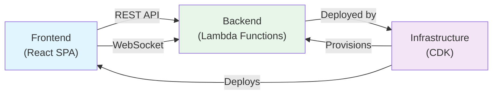

# Dependencies

## Internal Dependencies



### Frontend → Backend Dependencies
- **Type**: Runtime (HTTP/WebSocket)
- **Reason**: Frontend calls REST API for card operations and connects to WebSocket for real-time updates
- **Endpoints**:
  - REST: `https://xtv386hpgi.execute-api.ap-southeast-2.amazonaws.com/prod/`
  - WebSocket: `wss://a2ha2ia4wd.execute-api.ap-southeast-2.amazonaws.com/prod`

### Backend → Infrastructure Dependencies
- **Type**: Deployment
- **Reason**: Infrastructure CDK provisions all Lambda functions, API Gateway, DynamoDB, and other AWS resources
- **Deployment**: `cdk deploy --all`

### Infrastructure → Frontend Dependencies
- **Type**: Deployment
- **Reason**: Frontend Stack deploys built React application to S3 and CloudFront
- **Deployment**: S3 bucket deployment via CDK

## External Dependencies

### Frontend External Dependencies

| Dependency | Version | Type | Purpose | License |
|---|---|---|---|---|
| **react** | ^18.2.0 | Runtime | UI component framework | MIT |
| **react-dom** | ^18.2.0 | Runtime | React DOM rendering | MIT |
| **vite** | ^5.0.8 | Build | Build tool and dev server | MIT |
| **@vitejs/plugin-react** | ^4.2.1 | Build | React JSX support | MIT |
| **typescript** | ^5.3.2 | Build | TypeScript compiler | Apache 2.0 |
| **@types/react** | ^18.2.45 | Dev | React type definitions | MIT |
| **@types/react-dom** | ^18.2.18 | Dev | React DOM type definitions | MIT |

### Backend External Dependencies

| Dependency | Version | Type | Purpose | License |
|---|---|---|---|---|
| **@aws-sdk/client-dynamodb** | ^3.470.0 | Runtime | DynamoDB client | Apache 2.0 |
| **@aws-sdk/lib-dynamodb** | ^3.470.0 | Runtime | DynamoDB document client | Apache 2.0 |
| **@aws-sdk/client-bedrock-runtime** | ^3.470.0 | Runtime | Bedrock client | Apache 2.0 |
| **@aws-sdk/client-apigatewaymanagementapi** | ^3.470.0 | Runtime | API Gateway Management | Apache 2.0 |
| **uuid** | ^9.0.1 | Runtime | UUID generation | MIT |
| **@types/aws-lambda** | ^8.10.130 | Dev | Lambda type definitions | MIT |
| **@types/node** | ^20.10.0 | Dev | Node.js type definitions | MIT |
| **@types/uuid** | ^9.0.7 | Dev | UUID type definitions | MIT |
| **typescript** | ^5.3.2 | Dev | TypeScript compiler | Apache 2.0 |

### Infrastructure External Dependencies

| Dependency | Version | Type | Purpose | License |
|---|---|---|---|---|
| **aws-cdk-lib** | ^2.110.0 | Runtime | AWS CDK library | Apache 2.0 |
| **constructs** | ^10.3.0 | Runtime | CDK construct base | Apache 2.0 |
| **aws-cdk** | ^2.110.0 | Dev | AWS CDK CLI | Apache 2.0 |
| **@types/node** | ^20.10.0 | Dev | Node.js type definitions | MIT |
| **typescript** | ^5.9.3 | Dev | TypeScript compiler | Apache 2.0 |

## AWS Service Dependencies

### Lambda Functions
- **Depends on**: DynamoDB, Bedrock, API Gateway Management API, CloudWatch
- **Permissions**: IAM roles grant specific permissions to each function

### API Gateway (REST)
- **Depends on**: Lambda functions (Cards, AI Task)
- **Permissions**: Lambda invoke permissions

### API Gateway (WebSocket)
- **Depends on**: Lambda functions (Connect, Disconnect, Message)
- **Permissions**: Lambda invoke permissions

### EventBridge
- **Depends on**: Lambda function (AI Bottleneck)
- **Trigger**: 5-minute schedule

### DynamoDB
- **Depends on**: Lambda functions (all)
- **Tables**: Cards, Connections

### Bedrock
- **Depends on**: Lambda functions (AI Task, AI Bottleneck)
- **Model**: Claude 3 Sonnet

### CloudFront
- **Depends on**: S3 bucket
- **Origin**: S3 bucket with origin access control

### S3
- **Depends on**: Frontend build output
- **Deployment**: Automatic via CDK

## Dependency Graph

```
Frontend (React)
├── react (18.2.0)
├── react-dom (18.2.0)
├── vite (5.0.8)
│   └── @vitejs/plugin-react (4.2.1)
└── typescript (5.3.2)

Backend (Lambda)
├── @aws-sdk/client-dynamodb (3.470.0)
├── @aws-sdk/lib-dynamodb (3.470.0)
├── @aws-sdk/client-bedrock-runtime (3.470.0)
├── @aws-sdk/client-apigatewaymanagementapi (3.470.0)
├── uuid (9.0.1)
└── typescript (5.3.2)

Infrastructure (CDK)
├── aws-cdk-lib (2.110.0)
│   └── constructs (10.3.0)
├── aws-cdk (2.110.0)
└── typescript (5.9.3)

AWS Services
├── Lambda
│   ├── DynamoDB
│   ├── Bedrock
│   └── API Gateway Management API
├── API Gateway (REST)
│   └── Lambda (Cards, AI Task)
├── API Gateway (WebSocket)
│   └── Lambda (Connect, Disconnect, Message)
├── EventBridge
│   └── Lambda (AI Bottleneck)
├── CloudFront
│   └── S3
└── CloudWatch
    └── All Lambda functions
```

## Dependency Management

### Version Pinning
- **Frontend**: Caret ranges (^) for flexibility
- **Backend**: Caret ranges (^) for flexibility
- **Infrastructure**: Caret ranges (^) for flexibility
- **Lock File**: package-lock.json for reproducible builds

### Update Strategy
- **Minor/Patch**: Safe to update automatically
- **Major**: Requires testing and validation
- **AWS SDK**: Monitor for breaking changes in major versions

## Circular Dependencies
- **None detected**: Architecture is acyclic
- **Frontend → Backend**: One-way dependency (REST/WebSocket)
- **Backend → Infrastructure**: One-way dependency (deployment)

## Missing Dependencies

### Authentication & Authorization
- **Status**: Not implemented
- **Impact**: All endpoints are public
- **Future**: Add AWS Cognito or similar

### Input Validation
- **Status**: Minimal validation
- **Impact**: Potential for invalid data
- **Future**: Add schema validation (e.g., Zod, Joi)

### Error Handling
- **Status**: Basic error handling
- **Impact**: Limited error context
- **Future**: Add structured error handling and logging

### Testing
- **Status**: No test dependencies
- **Impact**: No automated tests
- **Future**: Add Jest, Vitest, or similar

### Logging
- **Status**: Console.log only
- **Impact**: Limited observability
- **Future**: Add structured logging (e.g., Winston, Pino)

### Rate Limiting
- **Status**: Not implemented
- **Impact**: Potential for abuse
- **Future**: Add API Gateway throttling or Lambda rate limiting

### Caching
- **Status**: No caching layer
- **Impact**: Repeated database queries
- **Future**: Add Redis or ElastiCache

## Dependency Security

### Known Vulnerabilities
- **Status**: No known vulnerabilities (as of analysis date)
- **Monitoring**: npm audit for security updates

### Supply Chain Security
- **npm Registry**: Official npm registry
- **Lockfile**: package-lock.json ensures reproducible builds
- **Verification**: npm verify-signature (optional)

## Performance Impact

### Bundle Size
- **Frontend**: ~150 KB (React + Vite)
- **Backend**: ~5 MB (AWS SDK + dependencies)
- **Infrastructure**: ~2 MB (CDK + dependencies)

### Load Time
- **Frontend**: <2 seconds (CloudFront cached)
- **Backend**: <100ms (warm Lambda)
- **API**: <100ms (API Gateway)

